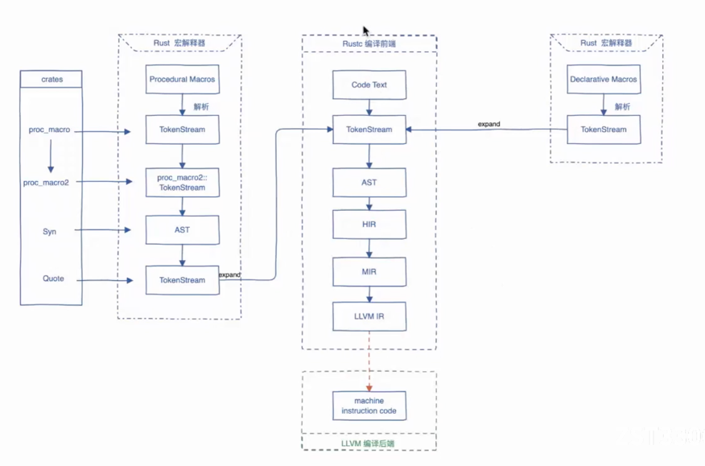

## 1 Rust compile flow(Rust编译流程) 


### 1.1 Main Compilation Workflow(主编译流程)
Rust 编译器 rustc 的核心编译流程包括以下阶段:  
The core compilation workflow of the Rust compiler (rustc) includes the following stages:  

#### 1.1.1 TokenStream
* 在代码解析后，所有代码都会被转化为 TokenStream，包括用户定义的代码和宏展开后的结果  
* 这个 TokenStream 是后续解析和语法分析的输入  

* After parsing, all code is transformed into a TokenStream, including user-defined code and macro-expanded code  
* This TokenStream serves as the input for subsequent parsing and syntax analysis  


####  1.1.2 抽象语法树（AST, Abstract Syntax Tree）
* rustc 将标记流解析为 AST
* AST 是源代码的树状结构表示，包含了所有语法结构的信息
* 在这个阶段，编译器主要进行语法检查和初步的代码验证

* rustc parses the token stream into an AST
* The AST is a tree-like representation of the source code, containing all syntactic structures
* At this stage, the compiler primarily performs syntax checking and initial code validation

####  1.1.3 高级中间表示（HIR, High-Level Intermediate Representation）
* AST 会被转换为 HIR
* HIR 是更抽象的代码表示形式，抛弃了某些具体的语法细节，专注于逻辑结构

* The AST is converted into HIR.
* HIR is a more abstract representation of the code, discarding certain syntactic details and focusing on logical structure

####  1.1.4 中级中间表示（MIR, Mid-Level Intermediate Representation）
* HIR 会进一步被优化为 MIR
* MIR 是一种专门为优化设计的中间表示，方便进行所有权检查、内存安全检查和优化
* Rust 的借用检查器在 MIR 层面运行，以确保代码符合所有权规则

* The HIR is further optimized into MIR
* MIR is specifically designed for optimization, ownership checking, and memory safety checks
* Rust's borrow checker operates at the MIR level to ensure that the code complies with ownership rules

####  1.1.5 LLVM IR
* MIR 被转换为 LLVM IR(LLVM 的中间表示)
* LLVM IR 是一种硬件无关的低级代码表示，后续由 LLVM 负责优化并生成机器代码

* The MIR is transformed into LLVM IR (LLVM Intermediate Representation)
* LLVM IR is a hardware-agnostic low-level representation of the code, which is later optimized and compiled into machine code by LLVM

### 1.2 宏解析阶段
#### 1.2.1 过程宏（Procedural Macros）
过程宏的作用是通过代码生成的方式对输入代码进行处理。具体流程如下：  
Procedural macros process input code by generating new code. The detailed workflow is as follows:  

**TokenStream:**
输入代码会被解析成一个 TokenStream，这是 Rust 代码的标记流, 这个标记流是后续操作的基础  
Input code is parsed into a TokenStream, which is a tokenized representation of Rust code. This token stream serves as the foundation for subsequent operations.


**proc_macro2 / Syn / Quote**:
使用 proc_macro2、syn 和 quote 等库解析和生成标记流
syn：将 TokenStream 解析为抽象语法树（AST）
quote：将 AST 转换回 TokenStream
这些工具简化了过程宏的实现过程

Libraries like proc_macro2, syn, and quote are used to parse and generate token streams  
syn: Parses the TokenStream into an abstract syntax tree (AST)  
quote: Converts the AST back into a TokenStream  
These tools simplify the implementation of procedural macros  

**AST Transformation**
解析的 TokenStream 转化为抽象语法树（AST）后，开发者可以对 AST 进行操作； 操作完成后，再将其转换回 TokenStream  

The parsed TokenStream is converted into an abstract syntax tree (AST), allowing developers to manipulate it；After modifications, the AST is converted back into a TokenStream  


**Expanding Back to the Compile(扩展回主编译器)**:
最终生成的 TokenStream 被传回 Rust 编译器的主流程，与源代码合并
The final TokenStream is passed back to Rust's compiler, merging with the source code


#### 1.2.2 声明式宏（Declarative Macros）
声明式宏采用规则匹配的方式，对输入代码进行简单替换。
其解析过程直接将输入转换成 TokenStream，然后将结果传递到编译器的下一阶段。
特点：
声明式宏的处理逻辑比过程宏更简单，主要依赖匹配规则。

## 2 Macro Categories(宏的分类)
**中文:** 
* 在Rust中，宏是一种元编程工具，它允许你编写生成代码的代码。
* Rust 提供了两种主要的宏类型：声明宏（Declarative Macros）和过程宏（Procedural Macros）

**英文:**
* Macros in Rust are a metaprogramming tool that allows you to write code that generates other code. 
* Rust provides two main types of macros: Declarative Macros and Procedural Macros. They differ significantly in functionality and use cases.

### 2.1 声明宏 (Declarative Macros)
**中文:**
1. 使用 macro_rules! 关键字定义
2. 通过模式匹配和替换来生成代码
3. 主要用于简单的代码生成和文本替换

**英文:**
1. Defined using the macro_rules! keyword
2. Generates code using pattern matching and substitution
3. Primarily used for simple code generation and text substitution

**示例 | Exampl**e:
```rust
macro_rules! say_hello {
    () => {
        println!("Hello, world!");
    };
}

fn main() {
    say_hello!(); // Output: Hello, world!
}

```

### 2.2 过程宏 (Procedural Macros)
**过程宏**是通过编写 Rust 代码来生成 Rust 代码，它们可以实现更复杂和动态的代码生成  
**Procedural macros** generate Rust code by writing Rust code and are capable of more complex and dynamic code generation  

**中文:**
1. 使用 #[proc_macro]、#[proc_macro_derive] 或 #[proc_macro_attribute] 定义
2. 输入和输出为 TokenStream，可以进行复杂分析和操作
3. 复杂的代码生成，动态生成逻辑
4. 分为三种：自定义派生宏、属性宏、函数宏

**英文:**
1. Defined using #[proc_macro]、#[proc_macro_derive] 或 #[proc_macro_attribute]  
2. Input and Output are TokenStream，allowing for complex analysis and manipulation  
3. Generate complex code and logic dynamically  
4. Divided into three types: custom derive macros, attribute macros, and function macros  

```rust
// #[proc_macro_derive]: 这是一个过程宏的属性标记，用于定义一个自定义派生宏（derive macro）。
// HelloMacro: 这个派生宏的名称，开发者可以在代码中通过 #[derive(HelloMacro)] 使用它。
#[proc_macro_derive(HelloMacro)]
// 输入和输出都是TokenStream
// TokenStream表示一段经过分词处理的代码流（标记流）
// 输入是宏被调用时的代码（如结构体定义的代码）
// 输出也是 TokenStream，表示宏生成的新代码
pub fn hello_macro_derive(input: TokenStream) -> TokenStream {
    // 使用 syn 库将输入的 TokenStream 解析为 抽象语法树（AST）
    let ast = syn::parse(input).unwrap();
    // 获取结构体名称
    // 从解析后的语法树中提取结构体或枚举的名称(标识符)
    // 例如，如果输入代码是 struct Pancakes;，name 的值将是 Pancake
    let name = &ast.ident;
    // 使用 quote 库生成代码
    // quote! 是一个宏，它允许在 Rust 中动态生成 Rust 代码
    let expanded = quote! {
        // 在 quote! 中，#name 用于插入之前提取的结构体名称
        impl HelloMacro for #name {
            fn hello_macro() {
                // stringify!(#name): 将 name 转换为字符串常量，用于打印。
                println!("Hello, Macro! My name is {}!", stringify!(#name));
            }
        }
    };
    // 转换为 TokenStream 并返回
    expanded.into()
}

// 使用
#[derive(HelloMacro)]
struct Pancakes;

fn main() {
    Pancakes::hello_macro(); // 输出: Hello, Macro! My name is Pancakes!
}

```

**整体工作流程:**
**输入:** 宏接收一个 TokenStream，表示应用 #[derive(HelloMacro)] 的结构体或枚举定义。 例如：struct Pancakes;
**解析:** 使用 syn 将 TokenStream 解析为语法树, 提取结构体名称。
**代码生成:** 使用 quote! 生成 Rust 代码，实现 HelloMacro 特性
**输出:** 返回新的 TokenStream，插入到调用位置。

### 2.3 声明宏和过程宏的区别(The difference of Declarative Macros and Procedural Macros)
**定义方式:**  
声明宏(Declarative Macros): 使用 macro_rules! 定义  
过程宏(Procedural Macros):  使用 #[proc_macro]、#[proc_macro_derive] 或 #[proc_macro_attribute] 定义  
 
**输入输出:**  
声明宏(Declarative Macros): 模式匹配，直接匹配输入并生成替换代码  
过程宏(Procedural Macros):  输入和输出为 TokenStream，可以进行复杂分析和操作

**适用场景:**  
声明宏(Declarative Macros):  简单的代码生成，文本替换  
过程宏(Procedural Macros):  复杂的代码生成，动态生成逻辑  

**灵活性:**  
声明宏(Declarative Macros): 受限于模式匹配和模板替换，功能简单  
过程宏(Procedural Macros):  通过 Rust 代码操作 AST，灵活且强大  

**复杂度:**  
声明宏(Declarative Macros): 语法简单，容易理解  
过程宏(Procedural Macros): 需要使用 proc_macro、syn、quote 等库，较复杂  

**执行阶段:**  
声明宏(Declarative Macros): 编译阶段直接展开  
过程宏(Procedural Macros): 编译的扩展阶段运行  

**类型:**  
声明宏(Declarative Macros): 只有一种类型：声明宏  
过程宏(Procedural Macros):  分为三种：自定义派生宏、属性宏、函数宏  

## 3 为什么过程宏必须定义在独立的 crate 中(Why Must Procedural Macros Be in a Separate Crate?)
### 3.1 编译阶段的不同(Different Compilation Phases)
过程宏在编译的扩展阶段执行，而常规代码在分析阶段之后处理。将过程宏放在单独的 crate 中确保它在正确的阶段加载和执行。  
Procedural macros are executed during the expansion phase of compilation, while regular code is handled after the analysis phase. Keeping procedural macros in a separate crate ensures they are loaded and executed at the correct stage.  

### 3.2 避免循环依赖(Avoid Circular Dependencies)
过程宏和使用它们的代码存在自然的依赖关系,将它们分离到不同的 crate 中可以避免循环依赖问题  
Procedural macros and the code using them have a natural dependency relationship. Splitting them into separate crates avoids circular dependency issues.  

## 4 proc-macro = true 的含义
此配置告诉 Cargo 和 Rust 编译器，该 crate 是一个过程宏 crate  
This configuration tells Cargo and the Rust compiler that the crate is a procedural macro crate  

过程宏 crate 定义了可以在编译时生成代码的宏  
Procedural macro crates define macros that generate code at compile time  

## 5 创建过程宏需要的依赖(Dependencies for Procedural Macros)
以下依赖是过程宏开发中常用的库：  
The following dependencies are commonly used for procedural macro development:  
```toml
[dependencies]
syn = "1.0"        # 解析输入的 TokenStream
quote = "1.0"      # 生成输出的 TokenStream
proc-macro2 = "1.0" # 提供对 TokenStream 的更细粒度控制
```