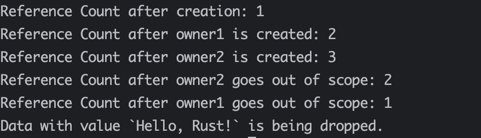
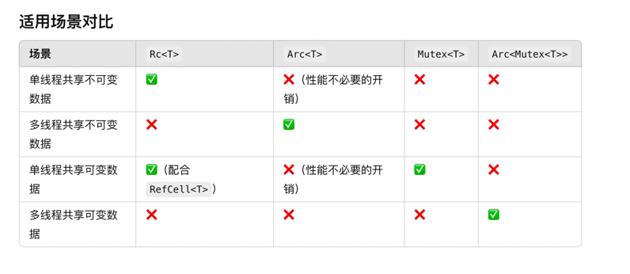

## 1 什么是指针? 什么是智能指针？
### 1.1 什么是指针？
指针就是指向一块内存区域的一个变量，它存储的是一个内存地址。通过指针，可以间接地访问或操作内存中的数据。  
A pointer is a variable that stores the memory address of another variable. Pointers allow indirect access to or manipulation of data in memory.  

**指针的关键特点**
**存储内存地址**：指针保存的是变量在内存中的地址，而不是变量本身的值。
**间接访问数据**：通过指针可以操作它指向的变量，例如读取或修改其值。
**节省内存和提高效率**：在需要传递大数据结构或共享资源时，指针避免了数据的拷贝。

### 1.2 什么是智能指针
* 智能指针，是一种数据结构，或者说是一个结构体，而不仅仅是一个变量  
* 智能指针除了封装指针的功能，还会存储额外的元数据和行为，常用于管理内存或资源，比如RC智能指针还可以用于引用计数，实现共享所有权。
* 智能指针可以通过实现特性(Trait)，为其附加行为。例如，Deref 和 Drop 特性分别提供了解引用能力和资源释放机制

* Smart pointers are a type of data structure, or more specifically, a struct, rather than just a variable. 
* In addition to encapsulating pointer functionality, smart pointers also store additional metadata and behaviors, and are commonly used for managing memory or resources.

## 2 智能指针的作用
### 2.1 自动管理资源(Automatic Resource Management)
智能指针通过 Drop 特性自动释放资源，避免了内存泄漏  
Smart pointers automatically release resources using the Drop trait, preventing memory leaks  

### 2.2 共享或者独占所有权(Automatic Resource Management)
智能指针允许多个所有者共享资源（如 Rc 和 Arc），或保证独占访问（如 Box）
Smart pointers enable shared ownership (e.g., Rc and Arc) or ensure exclusive access (e.g., Box)  

### 2.3 灵活的内存管理(Automatic Resource Management)
它们为动态分配、引用计数和多线程访问提供了强大的支持
They support dynamic allocation, reference counting, and thread-safe access  

### 2.4 提供额外功能(Automatic Resource Management)
通过实现 Deref，智能指针可以提供类似解引用操作，同时拥有指针的特性  
With the Deref trait, smart pointers offer value-like behavior while maintaining pointer capabilities  

## 3 智能指针使用场景(Use Cases of Smart Pointers)
**中文:**
1. 动态内存分配： 使用 Box<T> 在堆上存储数据，而不是栈
2. 共享数据： 使用 Rc<T> 或 Arc<T> 在多个所有者之间共享数据
3. 多线程环境： 使用 Arc<T> 和 Mutex<T> 实现线程安全的数据共享
4. 自定义资源管理： 使用智能指针封装文件句柄、网络连接等需要手动管理生命周期的资源
5. 内存优化： 使用 RefCell<T> 提供运行时的可变借用检查

**英文:**
1. Dynamic Memory Allocation: Use Box<T> to store data on the heap instead of the stack
2. Shared Data: Use Rc<T> or Arc<T> to share data among multiple owners
3. Multithreaded Environment: Use Arc<T> and Mutex<T> for thread-safe data sharing
4. Custom Resource Management: Wrap file handles, network connections, or other manually managed resources in smart pointers
5. Memory Optimization: Use RefCell<T> for runtime mutable borrow checking

## 4 常见智能指针(Common Smart Pointers)
### 4.1 Box<T>
将数据存储在堆上，提供动态大小类型和递归结构的支持  
#### 4.1.1 为什么需要Box<T>智能指针?
一般情况下，简单数据类型，比如i32、u8、bool、char等数据类型长度是固定的，可以直接在栈上分配。在栈上分配有哪些好处呢?  
* 第一: 分配和释放速度更快
* 第二: 作用域结束，栈上的数据就会释放
```rust
fn main() {
    let x = 42; // 栈上分配
    let y = true; // 栈上分配
    println!("x: {}, y: {}", x, y);
}
```
但是如果某些数据类型，是动态大小类型(Dynamic Sized Type)，在编译时无法确定大小，比如str, 那这种就不能直接使用str, 必须通过引用才能使用。  
又或者String、vector等数据类型就直接在堆上分配。  

对于堆而言，具有以下特点:  
* 第一: 分配和释放速度较慢，需要手动或通过智能指针管理
* 第二: 数据的生命周期需要明确控制

**总结**: 动态大小类型无法直接作为变量存储在栈上，因为栈分配需要固定大小;Box<T> 通过在堆上分配内存，间接允许存储动态大小类型  

#### 4.1.2 哪些场景可以使用Box<T> 智能指针
**场景一: 动态大小类型**  
Box<T> 打破了递归结构的“无限嵌套”问题，通过堆存储子节点，确保每个递归类型在栈上的大小是固定的。  
递归类型的每一层通过 Box 指向堆上的子节点，形成一个清晰的内存分配结构  

```rust
fn main() {
    let s: Box<str> = "Hello, Rust!".to_string().into_boxed_str(); // 将动态大小的 `str` 存储在堆上
    println!("{}", s);
}
```
**场景二: 数据结构是递归结构，比如链表、树形结构**
Box<T> 打破了递归结构的“无限嵌套”问题，通过堆存储子节点，确保每个递归类型在栈上的大小是固定的。  
递归类型的每一层通过 Box 指向堆上的子节点，形成一个清晰的内存分配结构  
```rust
enum List {
    Node(i32, Box<List>), // 子节点存储在堆上
    Nil, // 空节点
}

fn main() {
    let list = List::Node(1, Box::new(List::Node(2, Box::new(List::Nil)))); // 构建链表 1 -> 2 -> Nil
}

```

```rust
struct TreeNode {
    value: i32,
    left: Option<Box<TreeNode>>,
    right: Option<Box<TreeNode>>,
}

impl TreeNode {
    fn new(value: i32) -> Self {
        TreeNode {
            value,
            left: None,
            right: None,
        }
    }

    fn insert_left(&mut self, value: i32) {
        self.left = Some(Box::new(TreeNode::new(value)));
    }

    fn insert_right(&mut self, value: i32) {
        self.right = Some(Box::new(TreeNode::new(value)));
    }
}

fn main() {
    let mut root = TreeNode::new(1);
    root.insert_left(2);
    root.insert_right(3);

    println!("Root value: {}", root.value); // 输出: Root value: 1
}
```

### 4.2 Rc<T>
#### 4.2.1 Rc<T> 是“引用计数”的缩写(Reference Counting), 它允许多个所有者共享同一个数据，直到最后一个所有者释放数据时才销毁该数据  
```rust
use std::rc::Rc;

struct Data {
    value: String,
}

impl Drop for Data {
    fn drop(&mut self) {
        println!("Data with value `{}` is being dropped.", self.value);
    }
}

fn main() {
    {
        // 创建一个 Rc<Data> 实例
        let shared_data = Rc::new(Data {
            value: String::from("Hello, Rust!"),
        });

        println!("Reference Count after creation: {}", Rc::strong_count(&shared_data));

        {
            // 克隆 Rc，增加引用计数
            let owner1 = Rc::clone(&shared_data);
            println!("Reference Count after owner1 is created: {}", Rc::strong_count(&shared_data));

            {
                let owner2 = Rc::clone(&shared_data);
                println!("Reference Count after owner2 is created: {}", Rc::strong_count(&shared_data));
            } // owner2 离开作用域
            println!("Reference Count after owner2 goes out of scope: {}", Rc::strong_count(&shared_data));
        } // owner1 离开作用域
        println!("Reference Count after owner1 goes out of scope: {}", Rc::strong_count(&shared_data));
    } // shared_data 离开作用域
    // 此时，`Data` 被销毁，`Drop` 实现被调用
}
```


#### 4.2.2 不可变性：Rc<T> 只适用于不可变的数据，因为它的主要目的是共享数据而不是修改数据  
```rust
fn main() {
    let shared_data = Rc::new(String::from("World"));
    let owner1 = Rc::clone(&shared_data);
    let owner2 = Rc::clone(&shared_data);

    // 尝试修改 Rc 内部数据 (编译会报错)
    // shared_data.push_str(" New content!"); // ❌ 错误：不能修改 Rc 包裹的数据

    let new_shared_data = Rc::new(format!("{} World", "Hello"));

    println!("New Data: {}", new_shared_data);

    // shared data not changed
    println!("Original Data: {}", shared_data);
}
```

#### 4.2.3 Rc有什么缺点或者不足(The Challenge of Rc)
**问题一: 线程安全问题(Not Thread-Safe)**
描述: Rc<T> 是单线程的，不能跨线程使用。如果尝试在多线程环境中使用它，编译器会报错    
原因: Rc<T> 的引用计数在运行时更新，但它没有同步机制来保护计数操作是线程安全的   

Description: Rc<T> is single-threaded and cannot be shared across threads. Attempting to do so will result in a compilation error  
Reason: Rc<T> does not provide synchronization mechanisms for managing the reference count in a concurrent environment  
Solution: Use Arc<T> (Atomic Reference Counting) for thread-safe reference counting, though it incurs a performance cost due to atomic operations  

**问题二: 仅支持不可变数据**
描述: Rc<T> 的设计目的是共享不可变数据，因此不允许直接修改内部的数据  
解决办法: 如果需要修改，可以结合 RefCell<T> 或其他内部可变性模式，但这引入了运行时开销和潜在的逻辑复杂性  
Description: Rc<T> is designed for sharing immutable data and does not allow modification of its internal value  
Solution: Combine Rc<T> with RefCell<T> to enable interior mutability, allowing mutable access to the data while still benefiting from Rc<T>'s shared ownership  
```rust
use std::rc::Rc;
use std::cell::RefCell;

fn main() {
    let data = Rc::new(RefCell::new(42));

    let rc1 = Rc::clone(&data);
    let rc2 = Rc::clone(&data);

    *rc1.borrow_mut() += 1; // 修改数据
    println!("Updated value: {}", rc2.borrow()); // 输出: 43
}

```

**问题三: 无法处理循环引用**
描述: Rc<T> 的引用计数机制不能自动检测和清理循环引用，可能导致内存泄漏   
场景: 当两个或多个 Rc 相互引用时，引用计数永远不会归零，导致它们无法被回收  
解决: 循环引用问题 → 使用 Weak<T> 打破循环  

Description: Rc<T> cannot detect and handle cyclic references, which can lead to memory leaks. If two or more Rc<T> values reference each other, their reference counts will never drop to zero, preventing their data from being freed  

```rust
use std::rc::Rc;
use std::cell::RefCell;

struct Node {
    value: i32,
    next: Option<Rc<RefCell<Node>>>,
}

fn main() {
    let a = Rc::new(RefCell::new(Node { value: 1, next: None }));
    let b = Rc::new(RefCell::new(Node { value: 2, next: Some(Rc::clone(&a)) }));

    // 循环引用
    a.borrow_mut().next = Some(Rc::clone(&b));

    println!("Reference count of a: {}", Rc::strong_count(&a)); // 输出: 2
    println!("Reference count of b: {}", Rc::strong_count(&b)); // 输出: 2
    // 数据永远不会被回收
}

```
**问题四: 运行时性能开销**
描述: 每次克隆或丢弃 Rc 时，都会对引用计数进行增加或减少操作，这会带来一定的性能开销  
场景: 如果对性能要求极高（如在实时系统或游戏引擎中），Rc 的开销可能会成为瓶颈  
Description: Each clone or drop of an Rc<T> involves incrementing or decrementing the reference count, which adds a runtime cost  
Use Case: In performance-critical scenarios, such as real-time systems or game engines, this overhead might be a bottleneck  

### 4.3 Arc<T>
#### 4.3.1 什么是Arc<T>(What's the Arc<T>)
Arc<T> 也是Rust中支持引用计数的智能指针，但是是原子性的，主要用于在多个线程之间安全地共享数据。与 Rc<T> 不同，Arc<T> 使用原子操作管理引用计数，因此是线程安全的  
Arc<T> stands for Atomic Reference Counting, a smart pointer type in Rust designed for sharing data across multiple threads safely. Unlike Rc<T>, it is thread-safe because its reference count is managed using atomic operations  

#### 4.3.2 Arc<T>作用(Purpose of Arc<T>)
Arc<T> 的主要目的是在多线程环境中实现 不可变数据的共享所有权。它通过原子操作确保线程安全，非常适合需要多个线程同时读取相同数据的场景   
The main purpose of Arc<T> is to enable shared ownership of immutable data in multithreaded contexts. It ensures thread safety by using atomic operations, making it ideal for scenarios where multiple threads need read access to the same data  

##### 4.3.3 怎么使用Arc<T>(How to Use Arc<T>)?
```rust
use std::sync::Arc;
use std::thread;

fn main() {
    let data = Arc::new(String::from("Hello, Rust!"));

    let mut handles = vec![];

    for _ in 0..5 {
        let data_clone = Arc::clone(&data); // Create a new reference to the shared data
        // 将变量的所有权转移到线程中,当你通过 thread::spawn 创建一个新线程时，传入的闭包会在新线程中执行。因为新线程可能比当前线程存活得更久，因此闭包不能直接借用外部变量
        // 避免借用问题,如果没有 move，闭包默认会尝试借用它需要的变量。如果主线程和新线程同时访问这些变量，会导致数据竞争（Data Race），这在 Rust 中是不允许的
        let handle = thread::spawn(move || {
            println!("{}", data_clone); // All threads can safely access the data
        });
        handles.push(handle);
    }

    for handle in handles {
        handle.join().unwrap();
    }
}

```

#### 4.3.4.5 Rc<T> 和 Arc<T> 的区别
Rust 的类型系统通过 Send 和 Sync 标记线程安全性：  
**Rc<T> 的特性**
* 不实现 Send： Rc<T> 的引用计数更新在多线程中会导致数据竞争，因此不能跨线程使用
* 不实现 Sync： 即使多个线程只读共享，Rc<T> 也无法保证线程安全

**Arc<T> 的特性**
* 实现了 Send： Arc<T> 可以在多个线程间安全传递
* 实现了 Sync： 即使多个线程同时访问 Arc<T>，其内部的引用计数操作也是安全的

### 4.4 RefCell<T> 和 Cell<T>
#### 4.4.1 什么是Cell<T>和RefCell<T>
##### 4.4.1.1 什么是Cell<T>
Cell<T>是一种允许修改值但不允许借用的智能指针，出现的目的是为了解决不可变变量无法修改数据或者无法在共享所有权的Rc指针或者Arc指针下修改数据  
它主要用于存储和修改小数据值，比如数值、布尔值等。
**特点:**
* 值存取：通过 get 和 set 方法访问和修改数据
* 不可借用内部数据：无法通过引用的方式访问其内部数据
* 性能较高：适合存储实现了 Copy 的小型数据

Rust 的默认行为是不可变数据无法被修改。如果一个数据结构不可变（例如用 let 声明的变量），其字段同样不可变，即使修改某些字段是逻辑上合理的。比如:
```rust
struct Counter {
    value: i32,
}

fn main() {
    let counter = Counter { value: 0 }; // 不可变结构
    counter.value += 1; // ❌ 编译错误：无法修改不可变字段
}
```

无法在共享所有权中实现可变性,Rust 的所有权模型允许通过 Rc<T> 实现多个所有者，但默认情况下数据是不可变的。如果多个所有者需要修改共享的数据，就会遇到问题
```rust
use std::rc::Rc;

fn main() {
    let shared_data = Rc::new(42);
    *shared_data += 1; // ❌ 编译错误：`Rc<T>` 不允许修改其内部数据
}
```


##### 4.4.1.2 RefCell<T>
RefCell<T>在Cell<T>智能指针的基础上增加了引用的寓语义，可以进行借用。运行时借用检查：通过 borrow 和 borrow_mut 方法进行不可变或可变借用  
* 单一可变借用：同一时间只能存在一个可变借用  
* 多个不可变借用：同一时间可以有多个不可变借用   
动态检查，可能引发运行时错误：如果借用规则被违反，程序会在运行时崩溃  
支持更复杂的数据结构和操作：可以访问内部数据的引用  
```rust
use std::cell::RefCell;

fn main() {
    let ref_cell = RefCell::new(42); // 创建一个存储值的 RefCell

    // 不可变借用
    {
        let borrowed = ref_cell.borrow();
        println!("Borrowed value: {}", *borrowed);
        // borrowed 会在这里被释放
    }

    // 可变借用
    {
        let mut borrowed_mut = ref_cell.borrow_mut();
        *borrowed_mut += 1; // 修改内部值
        println!("Mutably borrowed value: {}", *borrowed_mut);
        // borrowed_mut 会在这里被释放
    }

    // 动态检查借用规则
    // let b1 = ref_cell.borrow();
    // let b2 = ref_cell.borrow_mut(); // ❌ 运行时 panic，因为同时存在可变和不可变借用
}
```

#### 4.4.2 使用场景
##### 4.4.2.1 Cell<T>使用场景
* 在不可变的上下文中存储和更新简单的标量数据，例如计数器或布尔标志
* 避免复杂的运行时检查
* 不需要访问内部数据的引用，只需要替换值

##### 4.4.2.2 RefCell<T>使用场景
* 在不可变上下文中需要动态地读取和修改复杂的数据结构
* 数据需要多次被借用，例如递归数据结构或共享的数据
* 可用在 Rc 或 Arc 中来实现共享的可变性


### 4.5 Mutex<T>
#### 4.5.1 什么是Mutex<T>
提供线程安全的互斥访问，保证多线程场景下，只有一个线程可以访问修改数据。但是注意，不保证多线程可以安全共享所有权，如果既要确保多线程可以安全共享所有权，又要保证安全修改访问数据，那么Mutex<T>必须和Arc<T>结合使用。  
完整的定义:   
Mutex<T> 是 Rust 中一种用于线程安全地共享和修改数据的智能指针。它实现了互斥锁（Mutual Exclusion），确保在多线程环境下只有一个线程可以访问或修改其内部的数据。Mutex<T> 是线程安全的，并且通常与多线程共享数据工具（如 Arc<T>）结合使用  

#### 4.5.2 Mutex<T>主要特性
* 线程互斥: 统一时刻只允许一个线程同时修改数据
* 封装共享数据: Mutex<T> 内部存储的数据可以通过调用 .lock() 方法获得访问权，并返回一个可变引用（MutexGuard）
* 死锁风险: 如果多个线程在获取锁时相互等待，可能会发生死锁

#### 4.5.3 使用场景
Mutex<T> 主要适用于需要在多线程环境中共享和修改数据的场景。常见的应用包括：
* 线程安全的全局状态： 例如，统计访问次数、共享配置、缓存等。
* 保护资源的并发访问： 例如，文件操作、网络连接池等。
* 同步并发操作： 例如，多个线程需要对同一数据结构进行修改时。
* 跨线程共享数据： 使用 Arc<Mutex<T>>，多个线程可以安全地共享数据

#### 4.5.4 Mutex<T> 和 Arc<T> 的区别与职责
**Mutex<T>：**  
* 用于保护共享数据的 内部可变性，确保在多线程环境中同一时间只有一个线程可以访问或修改数据
* 它解决的是线程同步问题，防止竞态条件

**Arc<T>：**  
* 提供一种线程安全的引用计数方式，用于让多个线程共享所有权
* 它解决的是多线程共享数据的所有权问题，确保数据的生命周期与引用计数一致

#### 4.5.5 示例代码
```rust
use std::sync::{Arc, Mutex};
use std::thread;

fn main() {
    let counter = Arc::new(Mutex::new(0)); // 线程安全的共享计数器

    let mut handles = vec![];

    for _ in 0..10 {
        let counter = Arc::clone(&counter); // 克隆 Arc
        let handle = thread::spawn(move || {
            let mut num = counter.lock().unwrap(); // 获取锁
            *num += 1; // 增加计数
        });
        handles.push(handle);
    }

    for handle in handles {
        handle.join().unwrap(); // 等待所有线程完成
    }

    println!("Result: {}", *counter.lock().unwrap()); // 输出：Result: 10
}
```


```rust
// 配合 Condvar 实现线程同步
use std::sync::{Arc, Mutex, Condvar};
use std::thread;

fn main() {
    let pair = Arc::new((Mutex::new(false), Condvar::new()));
    let pair_clone = Arc::clone(&pair);

    let handle = thread::spawn(move || {
        let (lock, cvar) = &*pair_clone;
        let mut started = lock.lock().unwrap();
        *started = true;
        cvar.notify_one(); // 通知主线程
    });

    let (lock, cvar) = &*pair;
    let mut started = lock.lock().unwrap();
    while !*started {
        started = cvar.wait(started).unwrap(); // 等待子线程通知
    }

    handle.join().unwrap();
    println!("Thread started!");
}
```

#### 4.5.6 场景对比



### 4.6 Cow<T>
#### 4.6.1 什么是Cow<T>
提线的一种写时复制Copy-on-Write的智能指针，它允许你在同一个数据结构中灵活地切换借用（borrowed）和拥有（owned）**的数据类型。
* 如果数据只读，Cow 会借用数据，避免不必要的拷贝
* 如果需要修改数据，则会将数据克隆为一个拥有所有权的副本，从而避免影响原始数据

#### 4.6.2 使用场景
**处理只读为主、少量写操作的场景**
Cow 最常见的场景是数据以只读为主，但在某些情况下需要进行写操作。例如，处理文本时大多数操作是读取，仅在特殊情况下需要修改。

**在 API 中提供灵活性**
Cow 可以让函数同时接受借用的只读数据和拥有的数据，从而提高函数的灵活性。

**延迟计算或优化**
在某些场景下，数据的修改可能不总是需要发生，使用 Cow 可以延迟数据的实际拷贝，减少不必要的性能开销。

#### 4.6.3 适用代码
**示例 1：基本用法**
以下示例展示如何根据是否需要写操作决定数据是借用还是复制:  
```rust
use std::borrow::Cow;

fn modify_data(input: &str) -> Cow<str> {
    if input.contains("rust") {
        let modified = input.replace("rust", "Rust");
        Cow::Owned(modified) // 拷贝并修改
    } else {
        Cow::Borrowed(input) // 借用
    }
}

fn main() {
    let data = "I love rust!";
    let result = modify_data(data);
    println!("Result: {}", result); // 输出：Result: I love Rust!
}
```
**分析：**  
    如果数据不需要修改，则直接返回 Cow::Borrowed，避免拷贝
    如果数据需要修改，则返回 Cow::Owned，创建一个修改后的副本

**示例 2：统一处理借用和拥有数据**
Cow 可以让函数接受多种类型的数据（借用或拥有），从而提高灵活性:  
```rust
use std::borrow::Cow;

fn process_data<'a>(data: Cow<'a, str>) {
    match data {
        Cow::Borrowed(borrowed) => println!("Borrowed data: {}", borrowed),
        Cow::Owned(owned) => println!("Owned data: {}", owned),
    }
}

fn main() {
    let borrowed_str: &str = "Hello, Rust!";
    let owned_string: String = String::from("Hello, Owned Rust!");

    process_data(Cow::Borrowed(borrowed_str)); // 处理借用数据
    process_data(Cow::Owned(owned_string)); // 处理拥有数据
}
```

**分析：**
    Cow 允许函数接受既可以是借用数据，也可以是拥有数据，避免了重复实现

**示例 3：字符串操作中的写时复制**
Cow 在处理字符串时特别常用，比如在需要高效读取和少量修改的场景:  
```rust
use std::borrow::Cow;

fn normalize(input: &str) -> Cow<str> {
    if input.starts_with("http://") {
        let new_string = input.replacen("http://", "https://", 1);
        Cow::Owned(new_string)
    } else {
        Cow::Borrowed(input)
    }
}

fn main() {
    let url = "http://example.com";
    let secure_url = normalize(url);
    println!("Normalized URL: {}", secure_url); // 输出：https://example.com
}
```

#### 4.6.4 场景对比：用 Cow<T> 和不用的区别
**不用 Cow<T> 的实现**
如果不使用 Cow<T>，我们需要分开实现借用和拥有数据的逻辑：  
```rust
fn process_borrowed(input: &str) {
    println!("Borrowed: {}", input);
}

fn process_owned(input: String) {
    println!("Owned: {}", input);
}
```
**缺点：** 重复代码，不够优雅; 无法统一处理借用和拥有数据

**使用 Cow<T> 的实现** 
Cow<T> 统一了接口:  
```rust
use std::borrow::Cow;

fn process<'a>(input: Cow<'a, str>) {
    println!("Processed: {}", input);
}
```
**优点：**
    无需重复代码，支持更灵活的输入类型
    提高了代码的可读性和可维护性

## 五 智能指针遇到的挑战(Challenges and Pitfalls of Smart Pointer)
### 5.1 循环引用(Reference Cycles)
Rc<T> 和 RefCell<T> 的组合可能导致引用循环，无法释放内存
解决方案：使用 Weak<T> 打破循环

Combining Rc<T> and RefCell<T> can lead to reference cycles, preventing memory deallocation.
Solution: Use Weak<T> to break the cycle

### 5.2 运行时借用检查的开销(Runtime Borrow Checking Overhead)
RefCell<T> 在运行时检查借用，可能带来性能开销
RefCell<T> introduces runtime borrow checking, which may impact performance

### 5.3 多线程数据共享的锁竞争(Lock Contention in Multithreaded Scenarios)
使用 Mutex<T> 时需要小心锁竞争
Using Mutex<T> requires careful handling to avoid lock contention

### 5.4 逻辑复杂性增加(Increased Logical Complexity)
过度使用智能指针可能使代码难以维护和理解
Overusing smart pointers can make code harder to maintain and understand
