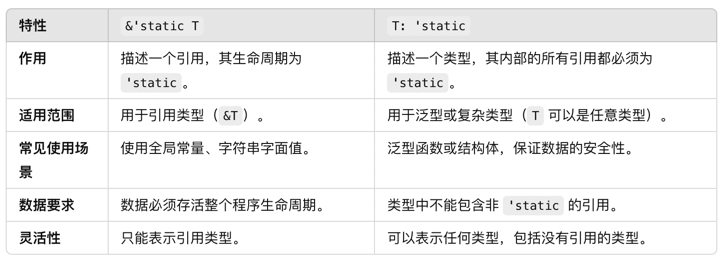

## 问题一: 集合添加的元素，生命周期不一致
### 1.1 示例代码
```rust
fn add(dataList: &mut Vec<&i32>, data: &i32) {
    dataList.push(data)
}

fn main() {
    let x = 1;
    let mut list = vec![&x];
    {
        let y = 2;
        add(&mut list, &y);
    }
}
```

**存在的问题:**  
x的生命周期保持在main函数内部, vector生命周期也保持在main函数内，但是y的生命周期在代码块执行结束就结束了
因此，可能导致vector会添加一个悬垂指针，即生命周期已经结束的引用，所以编译是不会通过的

### 1.2 如何保证编译通过
#### 1.2.1 添加生命周期标注
添加生命周期标注，明确告诉编译器data这个引用的生命周期会和dataList保持一样长，后续代码只要不访问这个vector,编译就没问题  
```rust
fn add<'a>(dataList: &'a mut Vec<&'a i32>, data: &'a i32) {
    dataList.push(data)
}

fn main() {
    let x = 1;
    let mut list = vec![&x];
    {
        let y = 2;
        add(&mut list, &y);
    }
}
```

有人会说，y的生命周期不是还没变吗，在代码块结束的时候，y的生命周期结束，还是存在悬垂引用啊，为啥编译可以通过？
因为我们明确告诉了编译器data这个引用的生命周期会和dataList保持一样长。但在代码块之外并没有实际使用 list 的内容。因此，编译器认为这段代码是安全的。
但是如果我们添加一段代码。也就是所谓的: **_即使代码逻辑上可能存在悬空引用，但只要未使用，编译器会认为代码是安全的_**。 如以下代码所示:  
```rust
fn add<'a>(dataList: &'a mut Vec<&'a i32>, data: &'a i32) {
    dataList.push(data)
}

fn main() {
    let x = 1;
    let mut list = vec![&x];
    {
        let y = 2;
        add(&mut list, &y);
    }

    // 添加这段代码，编译报错: ^^ borrowed value does not live long enough
    for item in &list {
        println!("item: {}", item)
    }
}
```
因为，虽然明确告诉了编译器data这个引用的生命周期会和dataList保持一样长，但是在后续的流程，编译器检查到会遍历vector, 依然会遍历到这个元素。  
也就是说后面实际使用 list 的内容。因此，编译器认为这段代码是安全的。


#### 1.2.2 如何避免这个问题
##### 1.2.2.1 存储值而不是引用
```rust
fn main() {
    let x = 1;
    let mut list = vec![x]; // 存储值
    {
        let y = 2;
        add(&mut list, y); // 存储值
    }
    println!("{}", list[1]); // 输出 2
}

fn add(dataList: &mut Vec<i32>, data: i32) {
    dataList.push(data);
}

```
##### 1.2.2.2 延长 y 的生命周期
```rust
fn main() {
    let x = 1;
    let mut list = vec![&x];
    let y = 2; // 将 y 提升到与 list 同级
    add(&mut list, &y);
    println!("{}", list[1]); // 现在可以安全访问
}
```
##### 1.2.2.3 使用 Rc 或 Arc（如果需要共享所有权）
```rust
use std::rc::Rc;

fn main() {
    let x = Rc::new(1);
    let mut list = vec![x.clone()];
    {
        let y = Rc::new(2);
        add(&mut list, y.clone()); // Rc 确保数据安全
    }
    println!("{}", list[1]); // 输出 2
}

fn add(dataList: &mut Vec<Rc<i32>>, data: Rc<i32>) {
    dataList.push(data);
}
```

### 1.3 可变引用被引用多次
#### 1.3.1 代码示例
```rust
fn add<'a>(dataList: &'a mut Vec<&'a i32>, data: &'a i32) {
    dataList.push(data)
}

fn main() {
    let mut datalist = vec![];
    let m = 1;
    let n = 2;

    add(&mut datalist, &m);
    add(&mut datalist, &n);
    println!("{datalist:?}")
}
```

当不可变引用引用多次的时候，也会发生错误。原因如下:  
在 main 函数中:  
第一次调用 add(&mut datalist, &m) 时:  
    datalist 被借用为可变引用，生命周期 'a 开始
    &m 被借用为不可变引用，其生命周期也与 'a 绑定
当尝试调用第二次 add(&mut datalist, &n) 时:  
    datalist 的上一次可变借用尚未结束
Rust 的借用规则禁止同时存在多个可变借用，或同时存在可变和不可变借用，因此编译器拒绝第二次借用  

#### 1.3.2 解决办法
##### 1.3.2.1 避免不必要的生命周期关联, 解绑可变引用借用和元素值生命周期绑定
问题是 dataList 和 data 的生命周期被过度关联。可以通过调整生命周期来解决:  
```rust
fn add<'a>(dataList: &mut Vec<&'a i32>, data: &'a i32) {
    dataList.push(data)
}

fn main() {
    let mut datalist = vec![];
    let m = 1;
    let n = 2;

    add(&mut datalist, &m);
    add(&mut datalist, &n);
    println!("{:?}", datalist);
}
```

或者  

```rust
fn add<'a, 'val>(dataList: &'a mut Vec<&'val i32>, data: &'val i32) {
    dataList.push(data)
}

fn main() {
    let mut datalist = vec![];
    let m = 1;
    let n = 2;

    add(&mut datalist, &m);
    add(&mut datalist, &n);
    println!("{datalist:?}")
}
```

为什么这里就不存在同时有多个可变借用呢?  
在 add(&mut datalist, &m) 调用中:  
    &mut datalist 是一个可变借用，但它的生命周期只持续到 add 函数执行结束
    在 add 函数内部，dataList 是一个可变引用，但只在 dataList.push(data) 执行期间生效，随后释放
在 add(&mut datalist, &n) 调用时:   
    &mut datalist 再次被借用，因为前一次调用的借用已经结束，Rust 的借用规则允许这种行为。
这符合 Rust 的借用规则：  
    一个可变借用在同一时间只能存在一个
    上一个可变借用在 add 返回后结束，因此不存在两个活跃的可变借用

## 问题二: struct生命周期
```rust
#[derive(Debug)]
pub struct SplitStr<'a> {
    start: &'a str, // 默认情况报错，缺少生命周期的指定: Missing lifetime specifier
    end: &'a str
}

pub fn split<'m, 'n>(text: &'m str, token: &'n str) -> Option<SplitStr<'m>> {
    let (start, end) = text.split_once(token)?;
    Some(SplitStr{start, end} )
}
```

编译会报错，因为data依赖于demo，但是demo在代码块执行完毕后结束，但是data生命周期延续到println!("{data:?}") 这一行，所以会报错
```rust
use rust_senior::lifetime::type_lifetime::{split, SplitStr};

fn main() {
    let mut data: Option<SplitStr> = None;
    {
        let demo = String::from("BTC::BTCUSDTM");
        data = split(&demo, "::");
    }
    println!("{data:?}")
}
```


## 问题三: 特殊生命周期
### 3.1 &'static T
'static 是一种特殊的生命周期，表示数据的生命周期贯穿整个程序的运行周期，通常分为以下几种情况：
**字符串字面量（存储在二进制文件中，生命周期为 'static）**  
```rust
fn main() {
    let s: &'static str = "Hello, world!";
    println!("{}", s); // "Hello, world!" 的生命周期是 `'static`。
}
```

**显式分配到 static 变量中的数据**  
```rust
static GLOBAL: i32 = 42;

fn main() {
    println!("Global value: {}", GLOBAL); // GLOBAL 的生命周期是 'static
}
```

**在堆上分配且不会提前释放的数据（通过 Box::leak 等方式实现）**  
```rust
fn main() {
    let x: &'static i32 = Box::leak(Box::new(10));
    println!("{}", x); // x 的生命周期是 'static，因为其内存不会被释放。
}
```


```rust
pub fn foo<'a>(input: &'a str) -> &'a str {
    // "abc" 和下面代码等价
    let reference: &'static str =  "abc";
    reference
    
    
}

fn main() {
    let x: &str;
    {
        let mut input = String::from("hello");
        x = foo(&input);
    }

    println!("X: {}", x)
}
```
"abc"默认是static生命周期，但是foo函数函数返回的引用依赖于input, input在程序块结束就销毁了，因此这个地方编译会报错  
将返回值的生命周期标注修改一下就好了:  
```rust
pub fn foo<'a>(input: &'a str) -> &'static str {
    // "abc"
    let reference: &'static str =  "abc";
    reference
}
```


### 3.2 &'_ T
'_ 是一种生命周期省略标注，它告诉编译器：生命周期由编译器推断，无需显式指定。它通常用于让代码更加简洁，但只能用于某些编译器可以安全推断的场景  

#### 3.2.1 函数签名中的省略
```rust
fn first_word(s: &'_ str) -> &'_ str {
    &s[..1]
}

fn main() {
    let text = "hello";
    let result = first_word(text);
    println!("{}", result); // 输出 "h"
}
```

#### 3.2.2 迭代器中的生命周期
```rust
fn split_words(input: &'_ str) -> impl Iterator<Item = &'_ str> {
    input.split_whitespace()
}

fn main() {
    let text = "hello world";
    for word in split_words(text) {
        println!("{}", word);
    }
}
```


## 四 生命周期绑定和型变
型变: 父类出现的地方，子类可以替换，主要分为不变、协变和逆变  
'a:'b 表示'a是'b的一个子类，也就是'a能够替换'b
T: 'a，如果T还有引用，那么生命周期要比'a生命周期长
&'static T  和 T：static区别:
**&'static T** 表示一个引用，这个引用的生命周期是 'static，也就是说，这个引用可以在程序的整个生命周期中有效  
**T: 'static** 是一个 生命周期约束，表示类型 T 中的所有引用都必须是 'static 的

```rust
// 使用 &'static T
fn static_ref_example() {
    let s: &'static str = "hello"; // 静态字符串字面值
    println!("{}", s);
}

// 使用 T: 'static
fn generic_static_example<T: 'static>(value: T) {
    // value 中的所有引用都必须是 'static
    println!("Value received: {:?}", value);
}

fn main() {
    // 示例 1: &'static T
    static_ref_example();

    // 示例 2: T: 'static
    let x = 42;
    generic_static_example(x); // i32 没有引用，因此满足 'static

    let s: &'static str = "hello"; // 静态字符串
    generic_static_example(s);    // 静态字符串字面值的引用满足 'static
}
```

## 五 生命周期reborrow
### 5.1 什么是reborrow
Reborrow 是指在 Rust 中将一个已经借用的引用再次借用的过程。这通常发生在函数调用、闭包使用或嵌套的借用场景中  
目的是临时将借用传递给另一个使用者，同时不失去对原始借用的控制权或者保证原始引用的有效性，同时临时允许其他地方使用这个引用  
```rust
fn main() {
    let mut a = 20;
    // 第一次借用
    let b = &mut a;
    // b解引用后再借用给c,也就是将a在内存中的值重新借用给c，此时原始的引用b会被冻结
    let c: &mut i32 = &mut *b; // 生命周期开始
    println!("{c:?}");  // 生命周期结束
    println!("{b:?}"); // 解冻原始引用b, 可以继续使用了
}
```

### 5.2 为什么需要reborrow?
将某个引用解引用后再临时借给其他变量, 否则借用传入到函数中或者其它代码块，原始引用就在后续无法被使用了  
借用的本质是保留所有权，当某一个值不希望在函数传递时候丧失所有权，所以可以借用；但是如果借用我们也不希望在函数中丧失所有权，后续还想继续使用，所以有了再借用  
总而言之，再借用具有以下一些功能:  
- 提高灵活性: 允许临时将借用传递给其他作用域或函数，避免过早失去对原始引用的控制
- 符合借用规则: 符合 Rust 的借用规则，确保在 Reborrow 的生命周期内原始引用被冻结，避免数据竞争
- 安全地嵌套借用: 在嵌套作用域中，确保原始引用和新的借用不会冲突
- 支持闭包和函数调用的灵活传递: 允许在闭包或函数调用中传递可变引用，而不会失去原始引用的使用权

### 5.3 reborrow相关示例和场景
#### 5.3.1 冻结原始引用，可以继续使用原始引用
```rust
fn main() {
    let mut a = 20;
    // 第一次借用
    let b = &mut a;
    // b解引用后再借用给c,也就是将a在内存中的值重新借用给c，此时原始的引用b会被冻结
    let c: &mut i32 = &mut *b;
    // 既然b被冻结了，这里为什么不会报错？
    println!("{b:?}");
}
```
既然b被冻结了，这里为什么不会报错？  
因为b虽然被冻结了，但是编译器会推断，后续没有使用c, 那么c的借用生命周期到此结束了，c生命周期结束，b就恢复了，因此可以使用


#### 5.3.2 冻结原始引用，不可以继续使用原始引用
```rust
fn main() {
    let mut a = 20;
    // 第一次借用
    let b = &mut a;
    // b解引用后再借用给c,也就是将a在内存中的值重新借用给c，此时原始的引用b会被冻结
    let c: &mut i32 = &mut *b;
    // b被冻结了，这里会报错？
    println!("{b:?}"); // ^^^^^ immutable borrow occurs here
    println!("{c:?}");
}
```

生命周期开始: let c: &mut i32 = &mut *b;  
生命周期结束: println!("{c:?}");   
在这个过程使用了被冻结的b: println!("{b:?}");  
因为发生再借用的c, 再其生命周期未结束之前，使用了b, 此时b还处于冻结状态,所以会报错

#### 5.3.3 正确使用reborrow
```rust
fn main() {
    let mut a = 20;
    // 第一次借用
    let b = &mut a;
    // b解引用后再借用给c,也就是将a在内存中的值重新借用给c，此时原始的引用b会被冻结
    let c: &mut i32 = &mut *b; // 生命周期开始
    println!("{c:?}");  // 生命周期结束
    println!("{b:?}"); // 解冻原始引用b, 可以继续使用了
}
```

### 5.4 函数参数是借用的场景下，返回生命周期较短的引用和较长的引用
#### 5.4.1 返回生命周期较短的引用
```rust
struct Draw;

// 参数是一个对不可变引用的不可变再借用
fn foo1<'a, 'b>(symbol: &'b &'a Draw) -> &'b Draw {
    // symbol: &'b &'a Draw
    // 连续是不可变引用: 说明'a是'b的一个子类，即'a生命周期长于'b, 'b是依赖了'a的  => 'a : 'b
    *symbol // 解引用是&'a Draw，但是要求返回一个短的引用，但是长的也没问题
}

// 参数是一个对可变引用的不可变再借用
fn foo2<'a, 'b>(symbol: &'b &'a mut Draw) -> &'b Draw {
    *symbol // &'a mut Draw, 一个可变引用可以转换成不可变引用
}

// 参数是一个对不可变引用的可变再借用
// fn foo3<'a, 'b>(symbol: &'b &'a Draw) -> &'b mut Draw {
//     // *symbol // &'a Draw, 一个不可变引用不可以转换成可变引用，所以会报错
// }

// 参数是一个对不可变引用的可变再借用
fn foo4<'a, 'b>(symbol: &'b mut &'a Draw) -> &'b Draw {
    *symbol // &'a Draw 长生命周期转换成短生命周期也是可以
}

// 参数是一个对可变引用的可变再借用
fn foo5<'a, 'b>(symbol: &'b mut &'a mut Draw) -> &'b Draw {
    *symbol // &'a mut Draw 一个可变引用可以转换成不可变引用
}
```

#### 5.4.2 返回生命周期较长的引用
```rust
struct Draw;
fn bar1<'a, 'b>(symbol: &'b &'a Draw) -> &'a Draw {
    *symbol // 解引用是&'a Draw，返回的生命周期也是&'a Draw, 因此没问题
}

// 报错: ^^^^^^^ function was supposed to return data with lifetime `'a` but it is returning data with lifetime `'b`
fn bar2<'a, 'b>(symbol: &'b &'a mut Draw) -> &'a Draw {
    *symbol // 解引用是&'a mut Draw，要求返回的是&'a Draw类型，要返回的生命周期作用域大于或者等于解引用后的生命周期，对于可变引用是不允许
}

fn bar3<'a, 'b>(symbol: &'b mut &'a Draw) -> &'a Draw {
    *symbol // 解引用是&'a Draw，但是要求返回&'a Draw，这里是不可变引用，因此这里没问题
}

//  ^^^^^^^ function was supposed to return data with lifetime `'a` but it is returning data with lifetime `'b`
fn bar4<'a, 'b>(symbol: &'b mut &'a mut Draw) -> &'a Draw {
    *symbol // *symbol // 解引用是&'a mut Draw，要求返回的是&'a Draw类型，要返回的生命周期作用域大于或者等于解引用后的生命周期，对于可变引用是不允许
}
```
## 六 trait 生命周期规则
### 6.1 什么是dyn trait?
#### 6.1.1 普通trait
普通trait: 通过 静态分发 实现多态，方法和类型在 编译时 确定，性能更高  
```rust
trait Shape {
    fn area(&self) -> f64;
}

// 实现 Shape trait 的类型
struct Circle {
    radius: f64,
}

struct Rectangle {
    width: f64,
    height: f64,
}

impl Shape for Circle {
    fn area(&self) -> f64 {
        std::f64::consts::PI * self.radius * self.radius
    }
}

impl Shape for Rectangle {
    fn area(&self) -> f64 {
        self.width * self.height
    }
}

fn main() {
    // 静态分发：编译时确定具体类型
    let circle = Circle { radius: 3.0 };
    let rectangle = Rectangle { width: 4.0, height: 5.0 };
    println!("Circle area: {}", circle.area());
    println!("Rectangle area: {}", rectangle.area());
}
```

#### 6.1.2 dyn trait
dyn trait: 通过 动态分发 实现多态，方法和类型在 运行时 确定，更灵活但有性能开销  
```rust
trait Shape {
    fn area(&self) -> f64;
}

// 实现 Shape trait 的类型
struct Circle {
    radius: f64,
}

struct Rectangle {
    width: f64,
    height: f64,
}

impl Shape for Circle {
    fn area(&self) -> f64 {
        std::f64::consts::PI * self.radius * self.radius
    }
}

impl Shape for Rectangle {
    fn area(&self) -> f64 {
        self.width * self.height
    }
}

fn main() {
    let shapes: Vec<Box<dyn Shape>> = vec![
        Box::new(Circle { radius: 3.0 }),
        Box::new(Rectangle { width: 4.0, height: 5.0 }),
    ];

    for shape in shapes {
        println!("Shape area: {}", shape.area());
    }
}
```

**动态分发的工作原理**  
**Box<dyn Shape> 是一个指向 trait 对象的智能指针**
    dyn Shape 的具体类型（Circle 或 Rectangle）在运行时才能确定
    dyn Shape 的方法调用会通过虚表（vtable）进行动态分发，而不是在编译时直接内联到具体实现。
**虚表(vtable)**
    当你创建 Box<dyn Shape> 时，Rust 会为每个具体类型（如 Circle 和 Rectangle）生成一张虚表，其中包含了该类型对 Shape trait 方法的实现。
    虚表存储了指向方法实现的函数指针，调用时通过这张表找到正确的方法
    在循环中调用 shape.area() 时，程序会通过虚表动态查找 area 方法的实现。
**类型和方法的动态确定**
    shapes 数组中可以存储不同的类型（Circle 和 Rectangle），这些类型在编译时是未知的
    只有在运行时，通过虚表，程序才能确定调用的是 Circle 的 area 还是 Rectangle 的 area

### 6.2 dyn trait场景有哪些
#### 6.2.1 裸引用(&dyn Trait 和 &mut dyn Trait)
直接通过引用（不可变或可变）访问 dyn Trait。这种方式通常用于函数参数或局部作用域  
**示例:**  
```rust
trait Shape {
    fn area(&self) -> f64;
}

struct Circle {
    radius: f64,
}

impl Shape for Circle {
    fn area(&self) -> f64 {
        std::f64::consts::PI * self.radius * self.radius
    }
}

fn print_area(shape: &dyn Shape) {
    println!("Area: {}", shape.area());
}

fn main() {
    let circle = Circle { radius: 3.0 };
    print_area(&circle); // 动态分发：通过 &dyn Shape 引用调用 area 方法
}
```

#### 6.2.2 Box智能指针
```rust
use std::io;

trait Shape {
    fn area(&self) -> f64;
}

struct Circle {
    radius: f64,
}

struct Rectangle {
    width: f64,
    height: f64,
}

impl Shape for Circle {
    fn area(&self) -> f64 {
        std::f64::consts::PI * self.radius * self.radius
    }
}

impl Shape for Rectangle {
    fn area(&self) -> f64 {
        self.width * self.height
    }
}

// 根据用户输入创建 Shape
fn create_shape(input: &str) -> Box<dyn Shape> {
    match input {
        "circle" => Box::new(Circle { radius: 5.0 }),
        "rectangle" => Box::new(Rectangle { width: 4.0, height: 6.0 }),
        _ => panic!("Unknown shape!"),
    }
}

fn main() {
    println!("Enter shape type (circle or rectangle):");

    let mut input = String::new();
    io::stdin().read_line(&mut input).unwrap();
    let input = input.trim();

    let shape = create_shape(input); // 类型在运行时确定
    println!("Shape area: {}", shape.area());
}
```

#### 6.2.3 Rc智能指针
```rust
use std::rc::Rc;

trait Renderable {
    fn render(&self);
}

struct Button {
    label: String,
}

struct TextBox {
    content: String,
}

impl Renderable for Button {
    fn render(&self) {
        println!("Rendering Button: {}", self.label);
    }
}

impl Renderable for TextBox {
    fn render(&self) {
        println!("Rendering TextBox: {}", self.content);
    }
}

fn main() {
    // 使用 Rc 动态分发并共享 UI 元素
    let button: Rc<dyn Renderable> = Rc::new(Button {
        label: String::from("Submit"),
    });
    let text_box: Rc<dyn Renderable> = Rc::new(TextBox {
        content: String::from("Enter text here..."),
    });

    let shared_ui: Vec<Rc<dyn Renderable>> = vec![button.clone(), text_box.clone()];

    // 在多个地方共享 UI 元素
    for element in shared_ui {
        element.render();
    }

    // 其他地方依然可以使用这些元素
    button.render();
    text_box.render();
}
```


#### 6.2.4 Arc智能指针
```rust
use std::sync::Arc;
use std::thread;

trait Task: Send + Sync {
    fn execute(&self);
}

struct PrintTask {
    message: String,
}

struct ComputeTask {
    number: i32,
}

impl Task for PrintTask {
    fn execute(&self) {
        println!("PrintTask: {}", self.message);
    }
}

impl Task for ComputeTask {
    fn execute(&self) {
        println!("ComputeTask: {}", self.number * 2);
    }
}

fn main() {
    // 使用 Arc 来跨线程共享任务
    let task1: Arc<dyn Task> = Arc::new(PrintTask {
        message: String::from("Hello, world!"),
    });
    let task2: Arc<dyn Task> = Arc::new(ComputeTask { number: 42 });

    let tasks = vec![task1.clone(), task2.clone()];

    // 启动多个线程，执行共享任务
    let handles: Vec<_> = tasks
        .into_iter()
        .map(|task| {
            thread::spawn(move || {
                task.execute(); // 动态分发调用对应的 execute 实现
            })
        })
        .collect();

    // 等待所有线程完成
    for handle in handles {
        handle.join().unwrap();
    }
}
```

#### 6.2.5 集合中动态类型
```rust
trait Shape {
    fn area(&self) -> f64;
}

struct Circle {
    radius: f64,
}

struct Rectangle {
    width: f64,
    height: f64,
}

impl Shape for Circle {
    fn area(&self) -> f64 {
        std::f64::consts::PI * self.radius * self.radius
    }
}

impl Shape for Rectangle {
    fn area(&self) -> f64 {
        self.width * self.height
    }
}

fn main() {
    let shapes: Vec<Box<dyn Shape>> = vec![
        Box::new(Circle { radius: 2.0 }),
        Box::new(Rectangle { width: 3.0, height: 4.0 }),
    ];

    for shape in shapes {
        println!("Area: {}", shape.area());
    }
}
```


#### 6.2.6 异步上下文
```rust
use std::pin::Pin;
use std::future::Future;

trait Task {
    fn execute(&self);
}

struct MyTask;

impl Task for MyTask {
    fn execute(&self) {
        println!("Executing task");
    }
}

fn async_task() -> Pin<Box<dyn Future<Output = ()> + Send>> {
    Box::pin(async {
        println!("Async task started");
    })
}

fn main() {
    let task = MyTask;
    task.execute();

    let future = async_task();
    futures::executor::block_on(future);
}
```

### 6.3 Trait 对象的默认生命周期
在 Rust 中，dyn trait持有的引用会有一个默认的生命周期限制，称为默认对象生命周期约束(Default Object Lifetime Bound)  
当未显式为这些引用指定生命周期时，这些默认规则将自动推断生命周期，比如:  
```rust
trait Logger {
    fn log(&self) -> &str; // 返回对某个字符串的引用
}

struct ConsoleLogger<'a> {
    message: &'a str, // 持有一个字符串的引用
}

impl<'a> Logger for ConsoleLogger<'a> {
    fn log(&self) -> &str {
        self.message
    }
}

// 这里的 dyn Logger 实际上隐式带有一个生命周期约束
// fn print_log<'a>(logger: &'a (dyn Logger + 'a))
// &'a 表示这个引用本身的生命周期是 'a，也就是引用有效的时间范围，或者说是调用者决定的
// dyn Logger + 'a: 表示 dyn Logger 内部持有的引用的生命周期是 'a
// 这个 &'a 引用指向一个 dyn Logger 对象，该对象的内部引用的生命周期也必须是 'a
fn print_log(logger: &dyn Logger) {
    println!("Log: {}", logger.log());
}

fn main() {
    let message = String::from("Hello, World!");
    let logger = ConsoleLogger { message: &message };

    print_log(&logger); // 使用 &dyn Logger 进行动态分发
}
```

**规则一: 如果 dyn Trait 被用作泛型类型的类型参数，编译器会尝试从包含它的类型推断生命周期限制**  
- 如果推断的生命周期是唯一的，则使用该生命周期作为默认  
- 如果推断的生命周期不唯一，则必须显式指定  

**规则二: 如果无法从上下文推断生命周期，则使用以下规则**  
- 如果 trait 本身有一个单独的生命周期限制，则使用该生命周期  
- 如果 trait 使用 'static，则默认为 'static  
- 如果 trait 没有生命周期限制，则在表达式中推断生命周期，在表达式外默认为 'static  

### 6.3.1 如果 dyn Trait 被用作泛型类型的类型参数，编译器会尝试从包含它的类型推断生命周期限制
#### 6.3.1.1 如果推断的生命周期是唯一的，则使用该生命周期作为默认
**怎么推断生命周期是唯一的?**  
结论: 生命周期能够唯一推断的核心原因是 上下文中没有歧义  
Rust 的生命周期推断机制是基于以下原则:   
- 函数签名足够简单: 函数参数的生命周期是直接从调用者传递的引用中得出的
- 没有多源生命周期的竞争: 在调用函数时，只有一个输入参数 &T，且它的生命周期直接依赖于调用者传递的引用的生命周期
- 没有跨参数的生命周期关联: 如果函数参数中只有一个生命周期相关的引用，且没有与其他参数或返回值的生命周期交互，则可以直接推断出生命周期

```rust
trait Printer {
    fn print(&self);
}

struct CanonPrinter;

impl Printer for CanonPrinter {
    fn print(&self) {
        println!("Hello from Canon!");
    }
}

/**
 * T: 是一个泛型类型的参数, 必须实现了 Printer trait
 * ?Sized 是对 T 大小属性的放宽限制
 * 在 Rust 中，大多数类型默认是 Sized，意味着它们的大小在编译时是固定的
 * ?Sized 放宽了这个限制，允许类型 T 可能是一个动态大小类型, 常见的动态大小类型包括特征对象（例如 dyn Printer）
 * 因为 ?Sized，T 可以是一个大小固定的类型（如 CanonPrinter），也可以是一个动态大小类型（如 dyn Printer）
 */
// T 是一个实现了 Printer 特征的类型，同时它的大小可能是未知的（可能是 Sized，也可能是 ?Sized）
fn call<T: Printer + ?Sized>(item: &T) {
    item.print();
}
fn main() {
    let instance = CanonPrinter;
    call(&instance);
}
```
从函数签名分析:
- 参数 item: &T 是一个引用，其生命周期直接由调用时传入的引用决定
- 函数内没有尝试存储 item 的引用，也没有跨参数的生命周期关系
从生命周期唯一性来源分析:
- 在 main 函数中，&instance 是call函数的唯一输入，生命周期的约束在调用时只有一个来源，即 &instance
- 编译器可以直接推断 item 的生命周期等于 &instance 的生命周期

#### 6.3.1.2 如果推断的生命周期不唯一，则必须显式指定
```rust
trait Printer {
    fn print(&self);
}

struct CanonPrinter;
struct SumsangPrinter;

impl Printer for CanonPrinter {
    fn print(&self) {
        println!("Hello from Canon!");
    }
}

impl Printer for SumsangPrinter {
    fn print(&self) {
        println!("Hello from Sumsang!");
    }
}


// 这里没有显式指定&dyn Printer生命周期, 无法确定唯一，那么就可能会有悬垂引用等问题
// fn call(item: &dyn Printer) {
//     item.print();
// }
// 显式指定生命周期标准
fn call<'a>(item: &'a dyn Printer) {
    item.print();
}

fn main() {
    let instance1 = CanonPrinter;
    let instance2 = SumsangPrinter;

    call(&instance1);
    call(&instance2);
}
```

**原因一: Rust中规定dyn Trait 的引用本身必须带有明确的生命周期**
如果参数类型是dyn trait, 即动态分发类型，需要在运行时确定其实现。Rust中规定dyn Trait 的引用本身必须带有明确的生命周期，这是因为 Rust 需要知道引用在函数调用期间的有效性。  
如果参数声明为 item: &dyn Printer 而没有指定生命周期，Rust 无法推断，item 的生命周期是否只在函数调用期间有效，还是需要更长时间。  
例如，以下代码会报错:  
```rust
fn call(item: &dyn Printer) {
    item.print();
}
```
因为，Rust 无法从上下文中唯一确定 item 的生命周期，因此需要显式标注。  

原因二: 多个独立的生命周期来源
instance1 和 instance2 是两个不同的引用：

```rust
call(instance1);
call(instance2);
```
每次调用的生命周期是独立的，但如果函数签名没有显式标注生命周期，Rust 无法明确推断 reference1 和 reference2 的生命周期关系：  
它们是否必须共享同一个生命周期？ 或者它们可以有独立的生命周期？  


### 6.3.2 如果无法从上下文推断生命周期，则使用以下规则
#### 6.3.2.1 Trait 本身有生命周期限制, Rust 默认使用该生命周期
```rust
// trait本身有单独生命周期限制
trait Reader<'a> {
    fn read(&self) -> &'a str;
}

struct Text<'a> {
    content: &'a str,
}

impl<'a> Reader<'a> for Text<'a> {
    fn read(&self) -> &'a str {
        self.content
    }
}

// &dyn Reader<'a> 本身并没有显式指定生命周期，dyn Reader 是动态分发类型
// 原则上编译器无法从 reader 的上下文中推断出它的生命周期是否与 Text 的生命周期一致
// 但是Reader Trait 本身有 'a 生命周期限制，因此编译器会根据 Trait 的定义默认使用其显式生命周期
fn get_reader<'a>(reader: &dyn Reader<'a>) -> &'a str {
    reader.read()
}

fn main() {
    let text = Text {
        content: "Hello, Rust!",
    };

    let result = get_reader(&text);
    println!("{}", result);
}
```

**为什么无法从上下文推断？**  
- get_reader 的参数类型是 &dyn Reader<'a>，但 dyn Reader 是动态分发类型
- 编译器无法从 reader 的上下文中推断出它的生命周期是否与 Text 的生命周期一致
- Reader Trait 本身有 'a 生命周期限制，因此编译器会根据 Trait 的定义默认使用其显式生命周期。

**默认行为**： 因为 Reader Trait 本身带有 'a 生命周期，Rust 默认使用该生命周期  

#### 6.3.2.2 Trait 使用 'static, Rust 会默认将生命周期设置为 'static
**什么是 'static 生命周期？**  
在 Rust 中，'static 生命周期表示:
1. 数据在整个程序运行期间有效
2. 常见的'static生命周期场景:
- 存储在程序的常量或静态存储区中的数据(如字面量字符串 "hello")
- 没有引用其他短生命周期数据的结构体或实现

**为什么这里的StaticLogger是'static的？**
没有引用其他数据:  
- StaticLogger 没有任何字段
- 它的生命周期与引用无关，因此默认为 'static
实例是程序全局有效的:  
- 在 main 函数中创建的 StaticLogger 实例不需要绑定到特定作用域的生命周期
- 即使它存储在某个变量中，也不会依赖于任何其他生命周期，编译器默认推断其为 'static
```rust
struct StaticLogger;

impl Logger for StaticLogger {
    fn log(&self) {
        println!("Logging with 'static lifetime!");
    }
}
```


```rust
trait Logger {
    fn log(&self);
}

struct StaticLogger;

impl Logger for StaticLogger {
    fn log(&self) {
        println!("Logging with 'static lifetime!");
    }
}

fn main() {
    let logger: &dyn Logger = &StaticLogger; // Logger 的生命周期默认为 'static
    logger.log();
}
```

**为什么无法从上下文推断？**  
Trait 类型引用没有显式生命周期:    
- 参数 &dyn Logger 没有显式的生命周期标注
- Rust 编译器 需要通过上下文推断出 logger 的生命周期
dyn Logger 是动态分发类型: 
- dyn Logger 需要标明引用的有效性范围
- Rust 编译器无法从 let logger: &dyn Logger 的上下文中唯一推断出生命周期

**默认行为:** 如果 Trait 使用 'static，Rust 会默认将生命周期设置为 'static  

#### 6.3.2.3 Trait 没有生命周期限制, 则表达式中推断，表达式外默认为 'static
```rust
trait Greeter {
    fn greet(&self);
}

struct Person<'a> {
    name: &'a str,
}

impl<'a> Greeter for Person<'a> {
    fn greet(&self) {
        println!("Hello, {}!", self.name);
    }
}

fn main() {
    let name = String::from("Alice");
    let person = Person { name: &name };

    let greeter: &dyn Greeter = &person; // 在表达式中推断生命周期
    greeter.greet();
}
```

**为什么无法从上下文推断？**
- Person 的生命周期由 name 决定，而 greeter 的生命周期取决于 &person。
- Trait Greeter 没有显式的生命周期限制，编译器无法从上下文得知 &dyn Greeter 的引用应该存续多长时间。
- 在表达式中（如 let greeter = ...），编译器可以从 person 推断生命周期，但离开表达式时会默认使用 'static。

